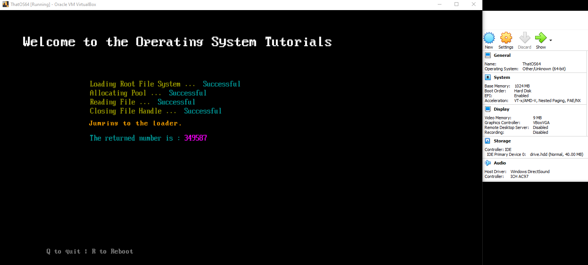
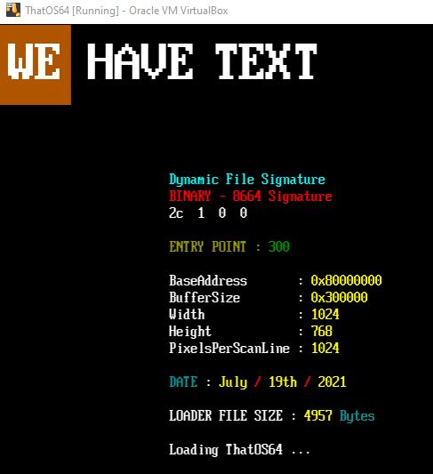
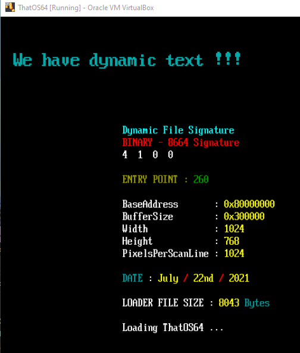
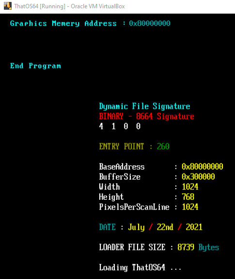

# Step by Step Tutorials on how to code a 64-Bit loader and kernel for OS Development

  
  
  
  

# NOTES  
- Although this can work on real hardware, I do NOT recommend doing so unless you know what you are doing. Use virtualbox or qemu until **you know** you have solid working code.
- For CODE1, you will need the BOOTX64.EFI file from my other GitHub Repo. https://github.com/ThatOSDev/UEFI-Tuts  
- The drive.hdd file is included, I didn't realize this when I made the first video.  
- The bios64.bin file is for qemu to work. Otherwise QEMU will fail to load.  
- Although the BUILD INSTRUCTIONS shows Windows, MAC or Linux, this tutorial series is using a windows host. However all code and makefile command switches should all work if you follow the build instructions.  

# TOOLS NEEDED  
- OSFMount ---- https://www.osforensics.com/tools/mount-disk-images.html  
- QEMU ( Optional ) ---- https://www.qemu.org/  
- VirtualBox ( Optional ) ---- https://www.virtualbox.org/  
- GCC for windows ---- https://nuwen.net/mingw.html  

# BUILD INSTRCUTIONS  
[https://github.com/ThatOSDev/ThatOS64/tree/master/BUILD.md](https://github.com/ThatOSDev/ThatOS64/tree/master/BUILD.md)  

# SOCIAL MEDIA LINK
**YOUTUBE** : https://www.youtube.com/channel/UCouyC9D6WFBwc24sqdkS-jw  

# READ THIS !!!
- THINGS YOU SHOULD KNOW BEFORE STARTING OS DEVELOPMENT  
    - The C Language  
    - Assembly Language  
    - How to read Hex Code ( Example : 0x8664 )  
    - How your Host Operating System works ( Such as windows or linux )  
    - How your compiler works ( Such as GCC )  
    - How to do research ( Don't be lazy )  
- **BEGINNER MISTAKES** : [https://wiki.osdev.org/Beginner_Mistakes](https://wiki.osdev.org/Beginner_Mistakes)  

# TUTORIALS
- RIGHT CLICK THE LINKS AND OPEN IN NEW TAB  
	- INITIAL SETUP &nbsp;&nbsp; &nbsp; &nbsp; &nbsp; &nbsp; &nbsp; &nbsp; &nbsp; &nbsp; &nbsp; &nbsp; &nbsp; &nbsp; &nbsp; &nbsp;&nbsp; &nbsp; &nbsp; &nbsp; &nbsp; &nbsp; &nbsp; &nbsp; &nbsp; &nbsp; &nbsp; &nbsp; &nbsp; &nbsp; &nbsp; &nbsp; --- [YT&nbsp;&nbsp; 1](https://www.youtube.com/watch?v=WCFEEboRHNg)  ---  [CODE](https://github.com/ThatOSDev/ThatOS64/tree/master/src/code1)  
	- ABI INTERFACE &nbsp; &nbsp; &nbsp; &nbsp; &nbsp; &nbsp; &nbsp; &nbsp; &nbsp; &nbsp; &nbsp;&nbsp; &nbsp; &nbsp; &nbsp; &nbsp; &nbsp; &nbsp; &nbsp; &nbsp; &nbsp; &nbsp; &nbsp; &nbsp; &nbsp; &nbsp; &nbsp; &nbsp; &nbsp; &nbsp; &nbsp; --- [YT&nbsp;&nbsp; 2a](https://www.youtube.com/watch?v=T7iXp1UwaiA) | [YT&nbsp;&nbsp; 2b](https://www.youtube.com/watch?v=zkCHrM-B0Ig) | [YT&nbsp;&nbsp; 2c](https://www.youtube.com/watch?v=eUOr01eVGVM) ---  [CODE](https://github.com/ThatOSDev/ThatOS64/tree/master/src/code2)  
	- GRAPHIC TEXT &nbsp;&nbsp; &nbsp; &nbsp; &nbsp;&nbsp; &nbsp; &nbsp; &nbsp; &nbsp; &nbsp; &nbsp;&nbsp; &nbsp; &nbsp; &nbsp; &nbsp; &nbsp; &nbsp; &nbsp; &nbsp; &nbsp; &nbsp; &nbsp; &nbsp; &nbsp; &nbsp; &nbsp; &nbsp; &nbsp; &nbsp; &nbsp; --- [YT&nbsp;&nbsp; 3](https://www.youtube.com/watch?v=9d7TWvGsbts) ---  [CODE](https://github.com/ThatOSDev/ThatOS64/tree/master/src/code3)   
	- ORGANIZATION AND TEXT POSITION &nbsp; &nbsp; &nbsp; &nbsp; &nbsp; &nbsp; &nbsp; &nbsp; &nbsp; &nbsp; &nbsp; &nbsp; --- [YT&nbsp;&nbsp; 4](https://www.youtube.com/watch?v=wa75ifmBmro) ---  [CODE](https://github.com/ThatOSDev/ThatOS64/tree/master/src/code4)  
	- Memory Manager - MMap / Paging / GDT / IDT &nbsp; &nbsp; &nbsp; --- [YT&nbsp;&nbsp; 5a](https://www.youtube.com/watch?v=o6Z67fHswd4) | [YT&nbsp;&nbsp; 5b] ---  [CODE](https://github.com/ThatOSDev/ThatOS64/tree/master/src/code5)  

More Tuts Coming soon... ( **NOTE : The order of this list is subject to change** )  

	* BMP / TGA Image Loading  
	* PCI  
	* AHCI  
	* Mouse  

  

  

  

  
 
